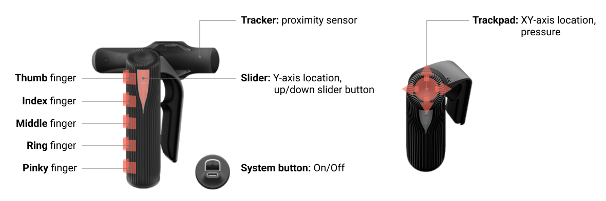
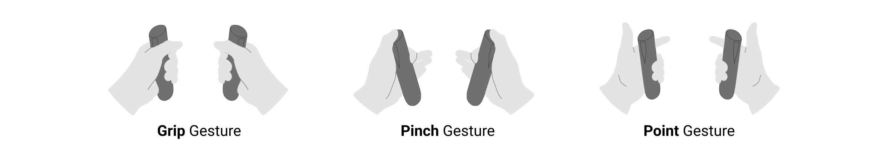

# etee Packet Elements

Each etee packet corresponds to one reading of data from the left or right eteeController. One packet of data is 44 bytes long in total. This includes 42 bytes for eteeController data and 2 delimiter bytes at the end of the packet. The packet delimiter is the sequence x0FFFF. A data packet contains tactile data, IMU measurements and device state information.

The following list describes the etee packet with parts grouped logically. The table below shows how and where the data appears in the packet. 

## List of Input Data

### Tactile Data

  
   
  <em>Tactile sensors in the eteeControllers and eteeTrackers.</em>

**Finger data** – For each of **thumb**, **index**, **middle**, **ring**, **pinky**:

- **{finger}PullValue (float)** – First analog range corresponding to softer pressure of a finger, usually indicative of finger flexion.
- **{finger}ForceValue (float)** – Second analog range corresponding to harder pressure of a finger, usually indicating finger squeeze.
- **{finger}Touched (bool)** – Boolean indicating a light touch of a finger on the eteeController.
- **{finger}Clicked (bool)** – Boolean indicating a harder press of a finger on the eteeController.

**Trackpad**:
- **trackpadCoordinates (Vector3)** – X (horizontal) coordinate of the estimated thumb position on a trackpad.Y (vertical) coordinate of the estimated thumb position on a trackpad.
- **trackpadPressures (Tuple<float, float>)** – First analog pressure value corresponding to the light pressure of a thumb on the trackpad. The second analog pressure value corresponds to the hard press of a thumb on the trackpad.
- **trackpadTouched (bool)** – Boolean indicating a light touch of a thumb on the trackpad.
- **trackpadClicked (bool)** – Boolean indicating a harder thumb press on the trackpad.

**Slider** (integrated under the LED light):
- **sliderValue (float)** – Y (vertical) coordinate of the estimated touch position on the slider.
- **sliderButton (bool)** – Boolean indicating that the slider (any part) was touched.
- **sliderUpButton (bool)** – Boolean indicating that the upper part of the slider was touched.
- **sliderDownButton (bool)** – Boolean indicating that the lower part of the slider was touched.

**Tracker** – Optional: If a tracker is attached to an eteeController:
- **trackerConnected (bool)** – Boolean indicating that a tracker is connected to the eteeController.
- **proxValue (float)** – Analog value corresponding to proximity to the tracker’s sensor.
- **proxTouched (bool)** – Boolean indicating that a tracker’s proximity sensor is at touch level.
- **proxClicked (bool)** – Boolean indicating that a tracker’s proximity sensor is at click level.

### Gestures

  
   
  <em>Tactile sensors in the eteeControllers and eteeTrackers.</em>

**Grip Gesture** – Gesture triggered when squeezing all fingers around the eteeController. A grip gesture is defined by:
- **squeeze (bool)** - Grip gesture triggered.
- **gripPressures(Tuple<float,float>)** – First analog pressure range corresponds to light grip. The second analog pressure range corresponds to a hard grip.
- **gripTouch (bool)** – Light grip around the eteeController.
- **gripClick (bool)** –  Hard grip around the eteeController

**Pinch Gestures** – Gesture with trackpad/thumb and index fingers closed on the eteeController. There are 2 variations of pinch: **trackpad** (pinch with trackpad and index finger) and **thumbfinger** (pinch with thumb finger and index finger). A pinch gesture is defined by:
- **pinch{Variation} (bool)** – Pinch gesture variation triggered. *e.g. pinchTrackpad*.
- **pinch{Variation}Analog (float)** – Analog pressure range for the pinch gesture. *e.g. pinchTrackpadAnalog*.

**Point Gestures** – Gesture with index finger extended and the others closed on the eteeController. There are 2 variations of point: **exclude_trackpad** (trackpad must not be touched) and **independent** (trackpad can be used alongside the gesture). A point gesture is defined by:
- **point{Variation}Analog (float)** - Analog pressure range for point gesture. *e.g. pinchTrackpad*.
- **point{Variation} (bool)** – Point gesture variation triggered.

### Inertial Measuring Units (IMU)
**IMU Data** – For each x, y and z component:
- accelerometer (Vector3) – Acceleration data from the accelerometer.
- gyroscope (Vector3) – Angular acceleration data from the gyroscope.
- magnetometer(Vector3) – Magnetic flux density data from the magnetometer.

### Device State
- isLeft (bool) – Boolean indicating whether the data packet comes from the right (0) or the left (1) eteeController.
- systemButtonPressed (bool) – System button pressed.

### Battery State
- battery (float) – Battery fuel gauge level.
- chargingInProgress (bool) – Boolean indicating if the device is plugged in and charging (true) or not (false).
- chargingComplete (bool) – Boolean indicating if the device has finished charging (true) or not (false).

## Data Packet Structure

The location of the parameters in the data packet can be found in the table below.

**Note**: When parsing the data, the parameter location within the data packet is given as follows: 

***Bits Location**: `bit_offset (byte, bit), length_in_bits`

|  Bits Location* |              Name              | Type |      Range     |
|:---------------:|:------------------------------:|:----:|:--------------:|
| 0 (0, 0), 1     | system_button                  | bool | 0 – 1          |
| 1 (0, 1), 1     | trackpad_clicked               | bool | 0 – 1          |
| 2 (0, 2), 1     | trackpad_touched               | bool | 0 – 1          |
| 3 (0, 3), 1     | thumb_clicked                  | bool | 0 – 1          |
| 4 (0, 4), 1     | index_clicked                  | bool | 0 – 1          |
| 5 (0, 5), 1     | middle_clicked                 | bool | 0 – 1          |
| 6 (0, 6), 1     | ring_clicked                   | bool | 0 – 1          |
| 7 (0, 7), 1     | pinky_clicked                  | bool | 0 – 1          |
| 8 (1, 0), 1     | thumb_touched                  | bool | 0 – 1          |
| 9 (1, 1), 7     | thumb_pull                     | uint | 0 – 126        |
| 16 (2, 0), 1    | index_touched                  | bool | 0 – 1          |
| 17 (2, 1), 7    | index_pull                     | uint | 0 – 126        |
| 24 (3, 0), 1    | middle_touched                 | bool | 0 – 1          |
| 25 (3, 1), 7    | middle_pull                    | uint | 0 – 126        |
| 32 (4, 0), 1    | ring_touched                   | bool | 0 – 1          |
| 33 (4, 1), 7    | ring_pull                      | uint | 0 – 126        |
| 40 (5, 0), 1    | pinky_touched                  | bool | 0 – 1          |
| 41 (5, 1), 7    | pinky_pull                     | uint | 0 – 126        |
| 48 (6, 0), 8    | trackpad_x                     | int  | 0 – 255        |
| 56 (7, 0), 8    | trackpad_y                     | uint | 0 – 255        |
| 64 (8, 0), 1    | proximity_touch                | bool | 0 – 1          |
| 65 (8, 1), 7    | proximity_value                | uint | 0 – 126        |
| 72 (9, 0), 1    | slider_touched                 | bool | 0 – 1          |
| 72 (9, 1), 7    | slider_value                   | uint | 0 – 126        |
| 80 (10, 0), 1   | grip_touched                   | bool | 0 – 1          |
| 80 (10, 1), 7   | grip_pull                      | uint | 0 – 126        |
| 88 (11, 0), 1   | grip_clicked                   | bool | 0 – 1          |
| 89 (11, 1), 1   | proximity_clicked              | bool | 0 – 1          |
| 90 (11, 2), 1   | tracker_on                     | bool | 0 – 1          |
| 91 (11, 3), 1   | is_right_hand                  | bool | 0 – 1          |
| 92 (11, 4), 1   | battery_charging               | bool | 0 – 1          |
| 93 (11, 5), 1   | slider_up_touched              | bool | 0 – 1          |
| 94 (11, 6), 1   | slider_down_touched            | bool | 0 – 1          |
| 96 (12, 0), 1   | battery_charge_complete        | bool | 0 – 1          |
| 97 (12, 1), 7   | battery_level                  | uint | 0 – 100        |
| 104 (13, 0), 1  | point_exclude_trackpad_clicked | bool | 0 – 1          |
| 105 (13, 1), 7  | trackpad_pull                  | uint | 0 – 126        |
| 112 (14, 0), 1  | point_independent_clicked      | bool | 0 – 1          |
| 113 (14, 1), 7  | grip_force                     | uint | 0 – 126        |
| 120 (15, 0), 1  | pinch_trackpad_clicked         | bool | 0 – 1          |
| 121 (15, 1), 7  | pinch_trackpad_pull            | uint | 0 – 126        |
| 128 (16, 0), 1  | pinch_thumbfinger_clicked      | bool | 0 – 1          |
| 129 (16, 1), 7  | pinch_thumbfinger_pull         | uint | 0 – 126        |
| 137 (17, 1), 7  | trackpad_force                 | uint | 0 – 126        |
| 145 (18, 1), 7  | thumb_force                    | uint | 0 – 126        |
| 153 (19, 1), 7  | index_force                    | uint | 0 – 126        |
| 161 (20, 1), 7  | middle_force                   | uint | 0 – 126        |
| 169 (21, 1), 7  | ring_force                     | uint | 0 – 126        |
| 177 (22, 1), 7  | pinky_force                    | uint | 0 – 126        |
| 184 (23, 0), 16 | accel_x                        | int  | -32768 – 32767 |
| 200 (25, 0), 16 | accel_y                        | int  | -32768 – 32767 |
| 216 (27, 0), 16 | accel_z                        | int  | -32768 – 32767 |
| 232 (29, 0), 16 | mag_x                          | int  | -32768 – 32767 |
| 248 (31, 0), 16 | mag_y                          | int  | -32768 – 32767 |
| 264 (33, 0), 16 | mag_z                          | int  | -32768 – 32767 |
| 280 (35, 0), 16 | gyro_x                         | int  | -32768 – 32767 |
| 296 (37, 0), 16 | gyro_y                         | int  | -32768 – 32767 |
| 312 (39, 0), 16 | gyro_z                         | int  | -32768 – 32767 |
| 328 (41, 0), 8  | unused_byte                    | n/a  | n/a            |