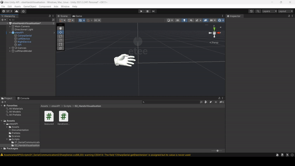
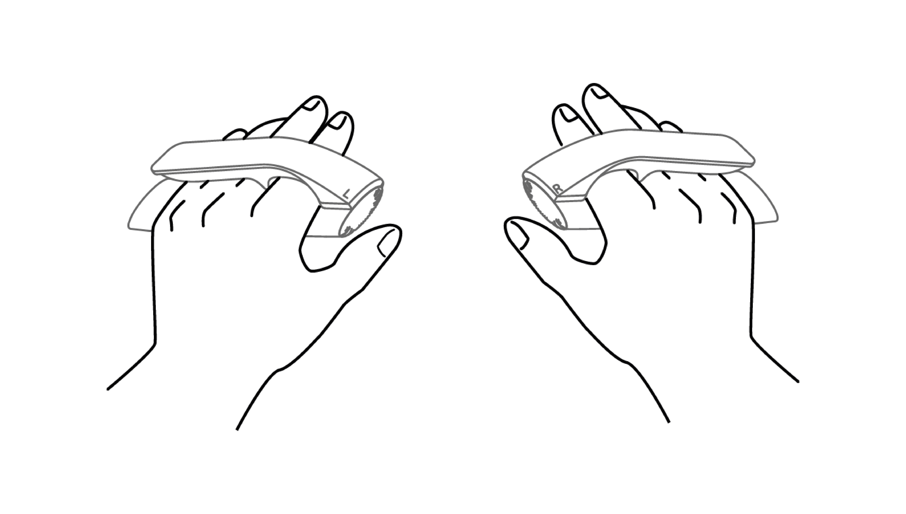
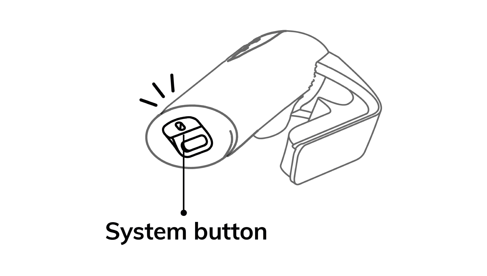

# How to Use the API

## Retrieving input data

The `eteeAPI.cs` script allows you to call and retrieve device data using ***Get commands***, such as <GetAllFingersPull()>, which returns each of the fingers pull data from either the left or right device.    

`Note`: For a full list of available device data, check the [**Input Data**][url-input-data] section.

```
using System.Collections;
using UnityEngine;

public class TestScript : MonoBehaviour {
    public eteeAPI api;

    private void Update()
    {
      // Retrieve left and right hand finger pull data
      float[] leftPullData = api.GetAllFingersPull(0);
      float[] rightPullData = api.GetAllFingersPull(1);

      // Print index values in terminal
      Debug.Log("Left Index Pull Pressure: " + leftPullData[1]);
      Debug.Log("Right Index Pull Pressure: " + rightPullData[1]);
    }
}
```

The eteeAPI script also contains ***Is functions*** that check the status conditions of connected devices. An example is the <IsAnyDeviceConnected()>, which checks if either controller device is connected.

```
using System.Collections;
using UnityEngine;

public class TestScript : MonoBehaviour {
    public eteeAPI api;

    private void Update()
    {
      // Example on how to check connection status of devices
      bool anyControllerConnected = api.IsAnyDeviceConnected();

      bool leftControllerConnected = api.IsLeftDeviceConnected();
      bool rightControllerConnected = api.IsRightDeviceConnected();
    }
}
```

## Hand finger visualization

After importing the etee Unity API, you can drag the `eteeAPI prefab` into your scene for immediate use. 

To visualise the finger curling, you can follow either option:
- **Default**: Bring the `LeftHandController / RightHandController prefabs` into the scene. This prefab offers a plug-and-play solution for hand visualisation, using a default hand model.
- **Custom**: If you wish to use your own hand model, just attach the `HandController.cs` script to your model. Make sure to reference the correct *Device* and *API* references in the *Inspector Panel*.

</br>

<p align="center">
  
  <br/>
  <em>HandController.cs script setup for custom models.</em>
</p>

## Creating Connections and Streaming Data

When the `eteeAPI prefab` is added into a the scene, the data streaming will automatically start at runtime.

The information below describes how the driver manages the device connections and data streaming. 

A serial connection between the driver and the etee devices is established by calling the ***EnableDataStreaming()*** function, which sends a serial command instructing the eteeControllers to stream sensor data.

The ***StartThread()*** function starts a data loop in a separate thread. The data loop reads serial data, parses it and stores it in an internal buffer. The data loop also listens to serial and data events and manages event callback functions.

## Resetting Sensor Baselines

If the finger curl data or other sensor data seem wrong, the easiest way to fix this is by triggering a **quick calibration**.

**Quick calibration** resets the electrodes signal baselines. For instance, if your real index finger is fully open but your virtual one appears to be flexed (i.e. indexPull is 55, instead of 0), a quick calibration will fix the issue (i.e. indexPull will be reset to 0).

### Steps for quick calibration:

1. Please, ensure that your or the user’s **fingers are fully stretched** out, as illustrated below.

<p align="center">
  
  <br/>
</p>

2. Trigger quick calibration by **double-clicking the system button** (aka. power button) in both eteeControllers. 

<p align="center">
  
  <br/>
</p>

This process is instantaneous and does not require any waiting time.

[url-input-data]: INPUT_DATA.md