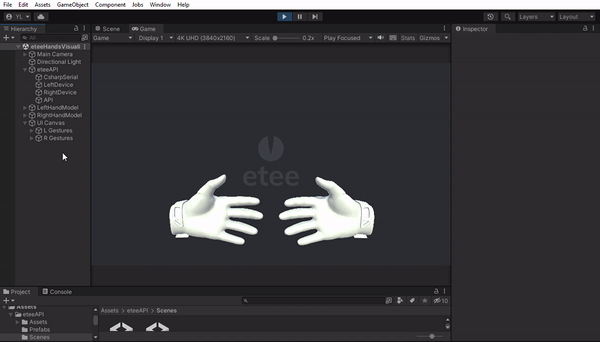
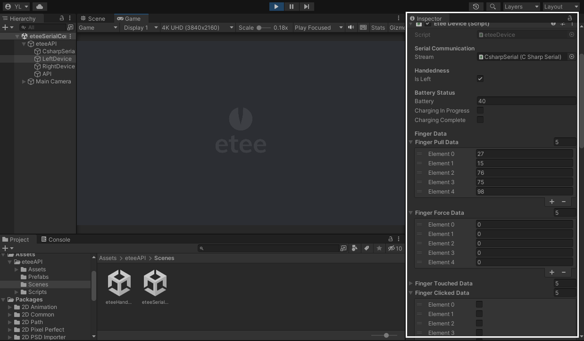
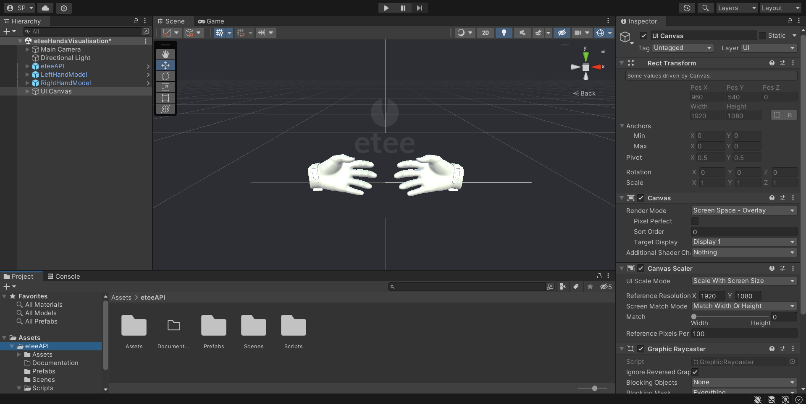
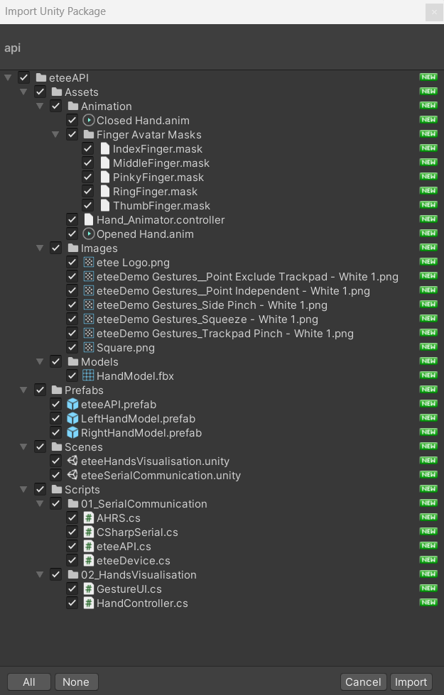
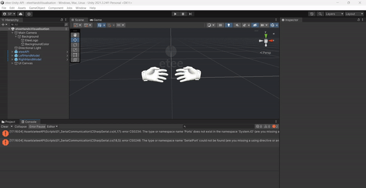

<!-- README file in MD for the etee Unity API repository-->
<a name="readme-top"></a>
<!--
*** Attribution and thanks: README template adapted from Othneil Drew's example, available at:
*** https://github.com/othneildrew/Best-README-Template
-->


<!-- PROJECT LOGO -->
<br />


<p align="center">
   Official Unity API for the eteeControllers.
   <br />
   <a href="https://github.com/eteeXR/etee-Unity-API/issues">Report Bug</a>
   ·
   <a href="https://github.com/eteeXR/etee-Unity-API/issues">Request Feature</a>
</p>


<!-- SHIELDS FOR REPO -->
<br />
<p align="center">
    <a>
        </a>
    <a>
        </a>
    <a>
        </a>
</p>

<!-- SHIELDS FOR SOCIALS -->
<p align="center">
    <a href="https://eteexr.com/">
        </a>
    <a href="customer@eteexr.com">
        </a>
    <a href="https://twitter.com/etee_tg0">
        </a>
</p>


<!-- TABLE OF CONTENTS -->
<details>
  <summary>Table of Contents</summary>
  <ol>
    <li>
      <a href="#about-the-project">About The Project</a>
    </li>
    <li>
      <a href="#scenes">Scenes</a>
      <ul>
        <li><a href="#scene-serialcomm">Scene 1: eteeSerialCommunication</a></li>
        <li><a href="#scene-hands">Scene 2: eteeHandsVisualisation</a></li>
      </ul>
    </li>
    <li>
      <a href="#getting-started">Getting Started</a>
      <ul>
        <li><a href="#clone-repo">Option 1: Clone the Repository</a></li>
        <li><a href="#store-package-installation">Option 2: Install from the Unity Asset Store</a></li>
      </ul>
    </li>
    <li><a href="#further-information">Further Information</a></li>
    <li><a href="#contributing">Contributing</a>
      <ul>
        <li><a href="#how-to-contribute">How to Contribute</a></li>
        <li><a href="#semantic-type-prefixes">Semantic Type Prefixes</a></li>
      </ul>
    </li>
    <li><a href="#license">License</a></li>
    <li><a href="#authors">Authors</a></li>
    <li><a href="#contact">Contact</a></li>
  </ol>
</details>


<!-- ABOUT THE PROJECT -->
## About the Project

The [etee Unity API][url-api-folder] allows developers to easily create applications that interface with the etee finger-tracking controllers. It enables seamless device data reading and communication, streamlining the process of integrating the controllers into your software development workflow.

<p align="center">
  
  <br/>
  <em>Demo of an interaction between the devices and the eteeHandsVisualisation scene.</em>
</p>

The package contains:
- **Prefab & Source Code** - etee Unity API
- **Scenes** - one for basic device communication and one for hand movement visualisation
- **Assets** - required for basic set-up

The API contains four main device communication scripts:
- **CsharpSerial.cs** - Retrieves device and port statuses. It also initialises device connection and data streaming commands.
- **EteeDevice.cs** - Gathers values from the device data packet.
- **EteeAPI.cs** - Call and retrieves values from the API
- **AHRS.cs** - Processes rotation information

<p align="right">(<a href="#readme-top">back to top</a>)</p>

<!-- SCENES -->
## Scenes

There are two main example scenes in the package:
- eteeSerialCommunication
- eteeHandsVisualisation

<a name="scene-serialcomm"></a>

### Scene 1: eteeSerialCommunication
This scene contains the etee Unity API prefab for developers to interact with.

When clicking on either *LeftDevice* or *RightDevice* gameobjects, you will be able to quickly see the numerical sensor values for the device in the ***Inspector panel***.

<p align="center">
  
  <br/>
  <em>Editor view of the eteeSerialComm scene.</em>
</p>

<a name="scene-hands"></a>

### Scene 2: eteeHandsVisualisation
This scene contains a visual rendition of the user's hands that mimic their gestures using the etee controller. 

Included in this scene are the following:

One pair of hand prefabs:
- 3D hand model
- Animator with hand open/closed states
- Hand controller script (retrieves API values for animation purposes)

Simple Gesture UI to visualise which gesture is being performed on each hand:
- Gesture Icons
- Gesture UI script (retrieves API gesture states and controls the icons shown) 

<p align="center">
  
  <br/>
  <em>Editor view of the eteeHandsVisualisation scene.</em>
</p>

<p align="right">(<a href="#readme-top">back to top</a>)</p>

<!-- GETTING STARTED -->
## Getting Started

<a name="clone-repo"></a>

### Option 1: Clone the repository

1. Open a command prompt.
2. Change the current working directory to the location where you want the cloned directory.
3. Type git clone, and then paste the URL for the Github repository.
    ```sh
    git clone https://github.com/eteeXR/etee-Unity-API.git
    ```

<a name="store-package-installation"></a>

### Option 2: (Coming soon) Install from the Unity Asset Store

**Import Package**

Begin by importing the etee Unity API package into your Unity project. 

To do this, follow the below steps:

1. Go to ***Window > Package Manager***, and select ***My Assets***.
2. Find the ***etee Unity API*** package, and click ***Import***. 
3. Make sure everything is selected when importing to avoid dependency issues within the API.

<p align="center">
  
  <br/>
  <em>etee Unity API package.</em>
</p>

**Setup Project Settings**

With the package imported make sure you switch to the correct API Compatibility Level:
1. Go to ***Edit > Project Settings > Player > Other Settings > API Compatibility Level***. 
2. Switch to the correct .NET compatibility version. If you are developing in Unity version 2021 select ***.NET Framework***. If you are using an older version of Unity you should use ***.NET 4.x*** instead.

<p align="center">
  
  <br/>
  <em>Ensuring .NET framework compatibility.</em>
</p>

`Note`: To see how to use the API in your custom project, check the [**Usage**][url-usage] section.

<p align="right">(<a href="#readme-top">back to top</a>)</p>

<!-- FURTHER INFORMATION -->
## Further Information

For more details regarding this API, check the documentation below:

- [Hardware Setup][url-hardware-setup]: How to set up your physical devices.
- [Usage][url-usage]: How to use the API in your custom project.
- [Input Data][url-input-data]: List of input data that can be retrieved from the devices.

<p align="right">(<a href="#readme-top">back to top</a>)</p>

<!-- CONTRIBUTING -->
## Contributing

### How to Contribute

Contributions are what make the open source community such an amazing place to learn, inspire, and create. 
Any contributions you make are **greatly appreciated**.

If you have a suggestion that would make this better, please fork the repo and create a pull request. 
You can also simply open an issue to describe your suggestion or report a bug.

1. Fork the Project
2. Create your Feature Branch (`git checkout -b feature/AmazingFeature`)
3. Commit your Changes (`git commit -m 'Add some AmazingFeature'`)
4. Push to the Branch (`git push origin feature/AmazingFeature`)
5. Open a Pull Request

### Semantic Type Prefixes

To help us and the community easily identify the nature of your *commit* or *issue*, use **semantic type prefixes** 
to precede your message / title.

Some common type prefixes include:

- `feat`: A new feature for the user, not a new feature for a build script.
- `fix`: Bug fix for the user, not a fix for a build scripts.
- `enhanc`: Enhancement or improvement to existing feature.
- `perf`: Code improved in terms of processing performance.
- `refactor`: Refactoring production code (e.g. renaming a variable).
- `chore`: Changes to the build process or auxiliary tools and libraries.
- `docs`: Changes to documentation.
- `style`: Formatting, missing semicolons, etc. No code change.
- `vendor`: Update version for dependencies and other packages.
- `test`: Adding missing tests or refactoring tests. No production code change.

**Format**: `<type>(<scope>): <subject>`, where < scope > is optional.

For example, your commit message header might look like this:
```text
feat(imu): Implemented Euler angles estimation from quaternion
```

For more references and guides on semantic code messages, see:

- [How are you writing a commit message?][url-semantic-type-prefixes-1] - by Darkø Tasevski
- [Git Commit Msg][url-semantic-type-prefixes-2] - Karma by Friedel Ziegelmayer

<p align="right">(<a href="#readme-top">back to top</a>)</p>


<!-- LICENSE -->
## License

Distributed under the Apache 2.0 License. See `LICENSE.txt` for more information.

<p align="right">(<a href="#readme-top">back to top</a>)</p>


<!-- AUTHORS-->
## Authors

This repository was created by the [TG0][url-tg0-website] team, for the [etee][url-eteexr-website] brand.

Code and documentation authors include:
- **Samuel Parsons** (API development, documentation and releases)
- **Pilar Zhang Qiu** (API development, documentation and releases)

<p align="right">(<a href="#readme-top">back to top</a>)</p>


<!-- CONTACT -->
## Contact

For any queries or reports about the API, please use the [**Issues tab**][url-issues-tab] in this repository.
When possible, use an identifier to help us describe your query, report or request. 
See more at: <a href="#semantic-type-prefixes">Semantic Type Prefixes</a>.

For further support or queries, you can contact us:
- Support e-mail: [customer@eteexr.com](customer@eteexr.com)
- Support Form: [https://eteexr.com/pages/support-form](https://eteexr.com/pages/support-form)

<p align="right">(<a href="#readme-top">back to top</a>)</p>


<!-- MARKDOWN LINKS & IMAGES -->
<!-- https://www.markdownguide.org/basic-syntax/#reference-style-links -->
[url-issues-tab]: https://github.com/eteeXR/etee-Unity-API/issues
[url-tg0-website]: https://tg0.co.uk/
[url-eteexr-website]: https://eteexr.com/
[url-semantic-type-prefixes-1]: https://dev.to/puritanic/how-are-you-writing-a-commit-message-1ih7
[url-semantic-type-prefixes-2]: http://karma-runner.github.io/1.0/dev/git-commit-msg.html
[url-api-folder]: Assets/eteeAPI/
[url-hardware-setup]: Documentation/HARDWARE_SETUP.md
[url-usage]: Documentation/USAGE.md
[url-input-data]: Documentation/INPUT_DATA.md